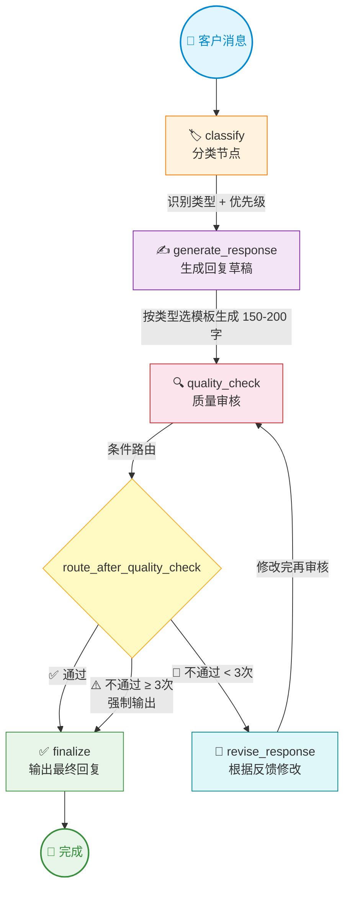

# 智能客服工单处理系统 — 流程图



## 节点说明

| 节点 | 功能 | 输入 | 输出 |
|------|------|------|------|
| **classify** | LLM 分析客户消息，判定工单类型和优先级 | `customer_message` | `category`, `priority` |
| **generate_response** | 根据分类结果选择模板，生成专业回复草稿 | `category`, `priority` | `response_draft` |
| **quality_check** | 审核回复是否达标（准确性、语气、可操作性、长度） | `response_draft` | `quality_result`, `quality_feedback` |
| **revise_response** | 根据质检反馈改进回复内容 | `response_draft`, `quality_feedback` | `response_draft`（覆盖） |
| **finalize** | 确认最终回复，输出工单摘要 | `response_draft` | `final_response` |

## 路由逻辑

```
route_after_quality_check(state):
    if quality_result == "通过" or revision_count >= 3:
        return "finalize"    # 通过或超过最大次数 → 输出
    else:
        return "revise"      # 不通过且还有机会 → 修改
```

## 状态结构

| 字段 | 类型 | 说明 |
|------|------|------|
| `customer_message` | `str` | 客户原始消息 |
| `category` | `str` | 技术问题 / 账单问题 / 通用咨询 / 紧急投诉 |
| `priority` | `str` | 低 / 中 / 高 / 紧急 |
| `response_draft` | `str` | 回复草稿（可被 revise 覆盖） |
| `quality_result` | `str` | 质检结论：通过 / 不通过 |
| `quality_feedback` | `str` | 质检改进建议 |
| `revision_count` | `int` | 修改累计次数（循环上限=3） |
| `final_response` | `str` | 最终确定的回复 |
| `log` | `list[str]` | 执行日志（`operator.add` 累加） |
